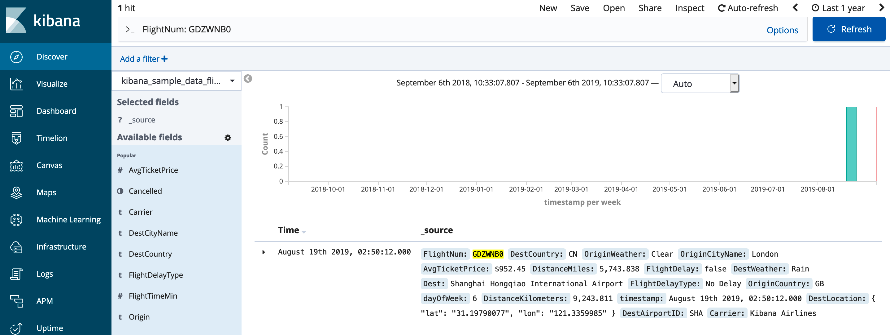

# Development

## Setting up a local environment

1. Download [Kibana](https://www.elastic.co/downloads/past-releases/kibana-6-8-1) (currently we support version 6.8) and unpack
1. Under Kibana's '*config*' directory, edit the *kibana.yml* file and make sure the following lines exists:

    ```yaml
    - elasticsearch.hosts: ["http://127.0.0.1:8080"] # This should point to your local HTTP sniffer (like fiddler) or directly to your local bridge
    - elasticsearch.customHeaders: {x-fiddler-reroute: 1} # When using fiddler in proxy mode this helps avoid unwanted reroutes of the requests. It won't harm to have it always.
    ```

1. Clone KibanaKustoBridge repository
1. Create a new settings file and name it _K2Bridge/appsettings.development.json_, and configuration as demonstrated in [appsettings.json](../K2Bridge/appsettings.json)
1. Start the proxy (and Kibana if not already running)
1. Browse to the Kibana UI [http://localhost:5601/](http://localhost:5601/)

## Testing

The easiest way to run and debug is by using Visual Studio with the [solution file](./KibanaKustoBridge.sln) included in the root folder of this repository.
More options are described below.

### Running Unit-tests from the command line

```sh
dotnet test ./tests/K2BridgeUnitTests/K2BridgeUnitTests.csproj
```

### Debugging Unit-tests in VS Code

In this mode you'll need to attach the debugger to the process.

1. Set environment variable:
    1. On Mac/Linux:

        ```sh
        export VSTEST_HOST_DEBUG=1
        ```

    1. On Windows (using Powershell)

        ```sh
        $env:VSTEST_HOST_DEBUG=1
        ```

1. Run the tests

```sh
dotnet test ./tests/K2BridgeUnitTests/K2BridgeUnitTests.csproj
```

You'll be prompted to attach a debugger to the test process.
Navigate to the debug tab and select the “.NET Core Attach” configuration from the dropdown.
Press the green play button and select the testhost process.

Once the debugger attaches, press the play button again.

### Manual testing

1. Go to the *Discover* tab
1. Choose a time window which includes data
1. Optionally include search term or filters
1. Entries from the Kusto table should appear in the search result



### End2End tests

The end-to-end test suite requires an existing installation of K2Bridge,
as well as a standalone installation of Elasticsearch,
to run parallel queries and compare the outputs.

A convenient way to run the tests locally is to connect to a Kubernetes
cluster that already has the services deployed.

```sh
az aks get-credentials -g $RESOURCE_GROUP -n aks-k2bridge-qa
kubectl port-forward service/elasticsearchqa-master 9200 &
kubectl port-forward service/k2bridge 8080 &
dotnet test K2Bridge.Tests.End2End
```

## Sensitive Information in logs
It is possible to prevent data with with potential sensitive information, such as PII, to be written to logs.
To support this first you need to set a settings flag `enableQueryLogging` to `True`. When True, the queries will be written to the logs. When false the query wont be logged.

In order to support this in code, you should pass to the logger an object called `SensitiveData` which is a wrapper for the data.
Serilog as the logging implementation will print to the logs this object.
An extension method to create this object is also provided in this project.
Here is an example for using the extension and conditional logs:

```C#
using K2Bridge.Telemetry;

// Creating a variable with potential sensitive information.
var translatedQuery = translator.Translate(header, query);

// Logging the header normally, and the potnetial sensitive data
// Is being converted to a conditional log object using "ToSensitiveData()"
// Please note the use of "@" which is used by Serilog to write all properties.
logger.LogDebug("Header:{@header}, query: {@QueryCommandText}", header, translatedQuery.QueryCommandText.ToSensitiveData());
```
