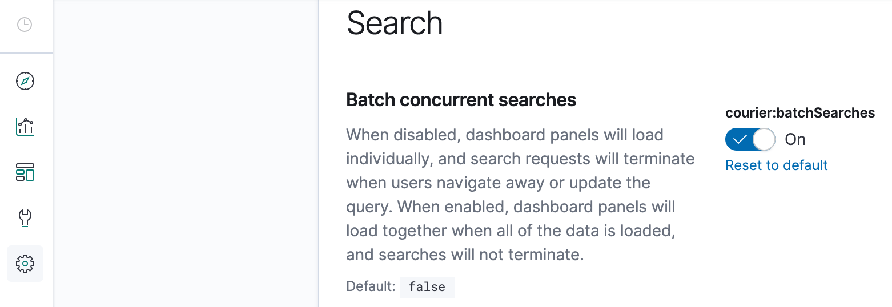

# Installation

## Requirements

* [Helm 3](https://github.com/helm/helm#install)
* AKS cluster or any other Kubernetes cluster (version 1.14 or newer - tested and verified up to version 1.16)
* An Azure Data Explorer (ADX) instance
    * You will need the ADX cluster URL and a database name
* An Azure AD service principal authorized to view data in ADX
    * You will need the ClientID and Secret
    * Important note: A service principal with 'Viewer' permission is enough. It is highly discouraged to use higher permissions (read, admin, etc...)
* [Optional] - Docker for image build

If you need to build the image, please follow the [build instructions](./build.md).

## Run on Azure Kubernetes Service (AKS)

1. By default, K2's Helm chart references a publicly available image located on Microsoft's Container Registry (MCR) which does not require any credentials and work out of the box.

1. Download the required Helm charts

    1. Add the Elasticsearch dependency to Helm:

        ```sh
        helm repo add elastic https://helm.elastic.co
        helm repo update
        ```

    1. The K2 chart is located under the [charts](../charts) directory. Clone the repository to get the chart.

        1. go to the K2 root repository directory

        1. run
            ```sh
            helm dependency update charts/k2bridge
            ```

1. Deploy

    * Set a few variables with the correct values for your environment:

        ```sh
        ADX_URL=[YOUR_ADX_CLUSTER_URL e.g. https://mycluster.westeurope.kusto.windows.net]
        ADX_DATABASE=[YOUR_ADX_DATABASE_NAME]
        ADX_CLIENT_ID=[SERVICE_PRINCIPAL_CLIENT_ID]
        ADX_CLIENT_SECRET=[SERVICE_PRINCIPAL_CLIENT_SECRET]
        ADX_TENANT_ID=[SERVICE_PRINCIPAL_TENANT_ID]
        ```

        Optional - Enable ApplicationInsights telemetry
        ```sh
        APPLICATION_INSIGHTS_KEY=[INSTRUMENTATION_KEY]
        COLLECT_TELEMETRY=true
        ```

        ```sh
        helm install k2bridge charts/k2bridge -n k2bridge --set image.repository=$REPOSITORY_NAME/$CONTAINER_NAME --set settings.adxClusterUrl="$ADX_URL" --set settings.adxDefaultDatabaseName="$ADX_DATABASE" --set settings.aadClientId="$ADX_CLIENT_ID" --set settings.aadClientSecret="$ADX_CLIENT_SECRET" --set settings.aadTenantId="$ADX_TENANT_ID" [--set image.tag=latest] [--set privateRegistry="$IMAGE_PULL_SECRET_NAME"] [--set settings.collectTelemetry=$COLLECT_TELEMETRY]
        ```

        The complete set of configuration options can be found [here](./configuration.md).

    * Deploy Kibana  
    The command output will suggest a helm command to run to deploy Kibana, similar to:

        ```sh
        helm install kibana elastic/kibana -n k2bridge --set image=docker.elastic.co/kibana/kibana-oss --set imageTag=6.8.5 --set elasticsearchHosts=http://k2bridge:8080
        ```

1. Configure index-patterns  
In a new installation of Kibana, you will need to configure the indexe-patterns to access your data.
Navigate to Management -> Index Patterns and create new indexes.
Note that the name of the index must be an **exact match** to the table name or function name, without any asterisk. You can copy the relevant line from the list.

Notes:
To run on other kubernetes providers, change in `values.yaml` the elasticsearch storageClassName to fit the one suggested by the provider.

1. Kibana 7 specific

If using Kibana 7, you must enable `courier:batchSearches` option under Advanced settings.

_Explanation: courier:batchSearches ensures the /\_msearch endpoint is used for all searches. Kibana 7 uses /\_search by default for the Discover tab, if no Time Filter is selected, which is not supported by K2Bridge currently._



